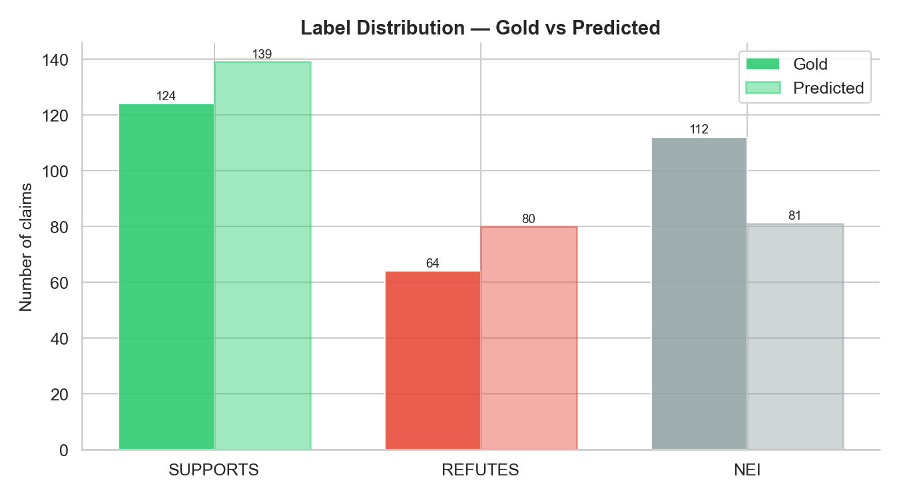
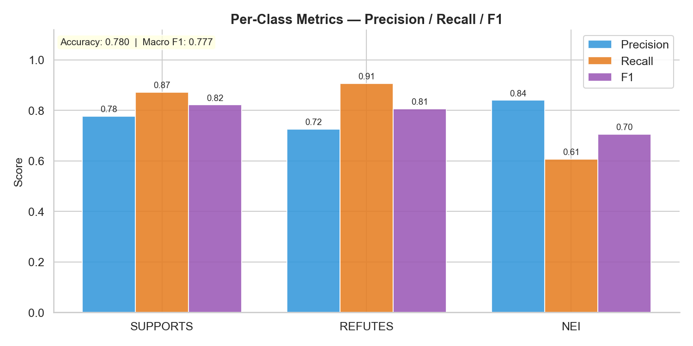
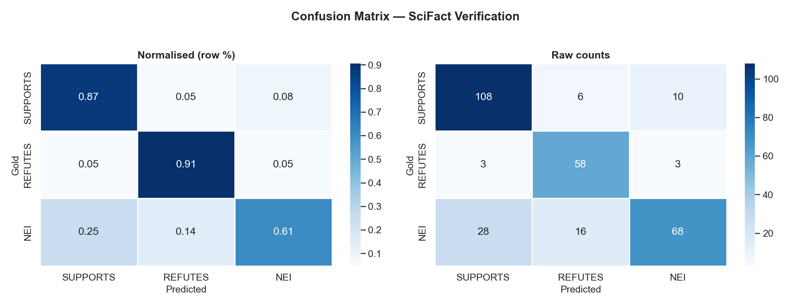
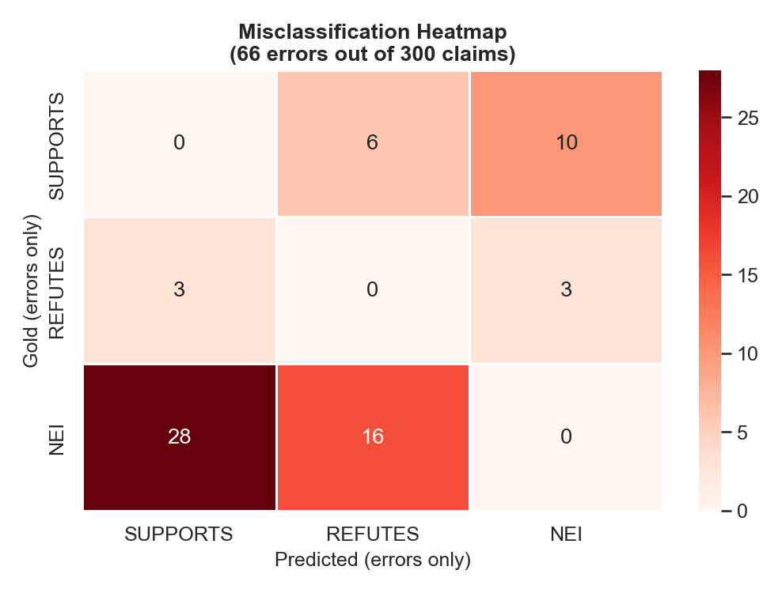
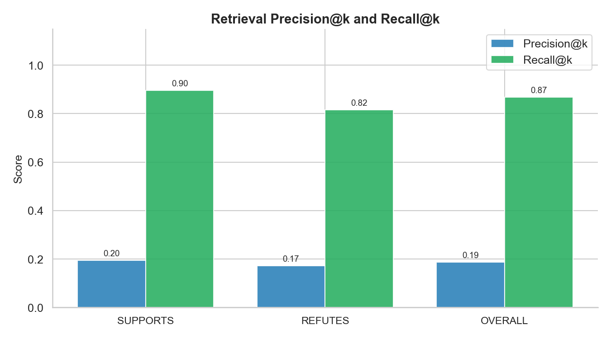
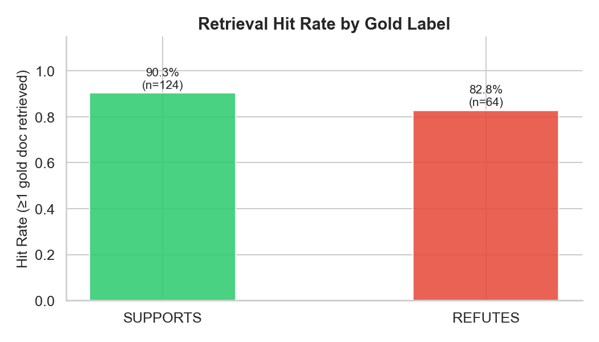
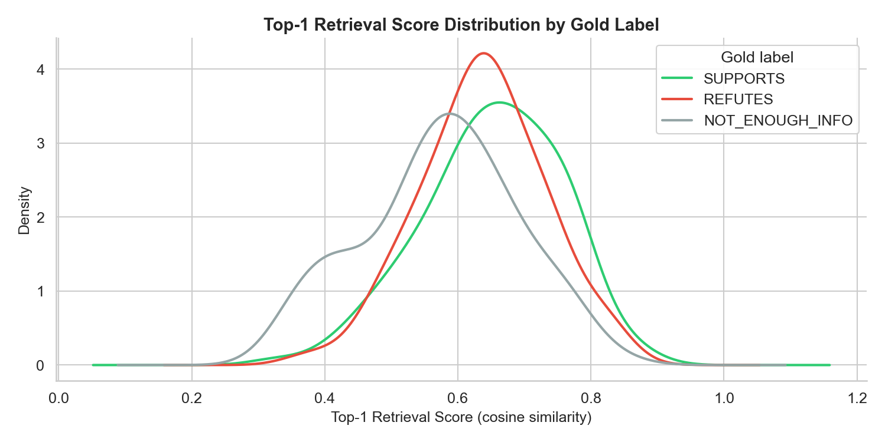
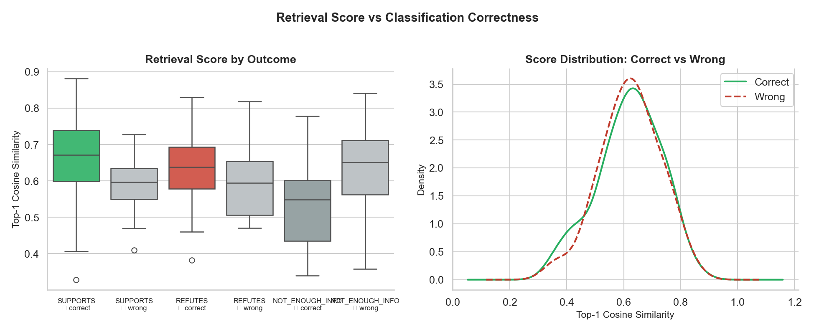

# Rilevamento della Disinformazione Scientifica — Rapporto di Valutazione

**Sistema:** RAG Pipeline · Gemini-2.5-flash · FAISS + all-MiniLM-L6-v2
**Dataset:** SciFact dev set · 300 claim · 3 classi
**Data:** Marzo 2026

---

## Indice

1. [Panoramica del Sistema](#1-panoramica-del-sistema)
2. [Prestazioni di Classificazione](#2-prestazioni-di-classificazione)
3. [Analisi degli Errori](#3-analisi-degli-errori)
4. [Qualità del Retriever](#4-qualità-del-retriever)
5. [Punti di Forza e Limiti](#5-punti-di-forza-e-limiti)
6. [Conclusioni](#7-conclusioni)

---

## 1. Panoramica del Sistema

La pipeline valutata è un sistema **RAG (Retrieval-Augmented Generation)** per la verifica automatica di affermazioni biomediche. Dato un claim in input, il sistema:

1. **Recupera** i 5 abstract più rilevanti dal corpus SciFact (~5.000 documenti) tramite FAISS con embedding locali (`all-MiniLM-L6-v2`, 384 dimensioni)
2. **Costruisce** un prompt strutturato con le evidenze recuperate
3. **Classifica** il claim tramite `Gemini-2.5-flash` in una delle tre etichette: `SUPPORTS`, `REFUTES`, `NOT_ENOUGH_INFO`
4. **Genera** una spiegazione in linguaggio naturale del verdetto

### Distribuzione del dataset

| Classe | Count | % |
|--------|------:|--:|
| `SUPPORTS` | 124 | 41.3% |
| `NOT_ENOUGH_INFO` | 112 | 37.3% |
| `REFUTES` | 64 | 21.3% |
| **Totale** | **300** | 100% |

> Il dataset è moderatamente sbilanciato: `REFUTES` rappresenta solo il 21% dei claim.

---

## 2. Prestazioni di Classificazione

### Metriche globali

| Metrica | Valore |
|---------|-------:|
| **Accuracy** | **0.7800** |
| **Macro F1** | **0.7772** |
| Weighted F1 | 0.7700 |
| Errori totali | 66 / 300 (22%) |

### Metriche per classe

| Classe | Precision | Recall | F1 | Support |
|--------|----------:|-------:|---:|--------:|
| `SUPPORTS` | 0.78 | 0.87 | **0.82** | 124 |
| `REFUTES` | 0.72 | 0.91 | **0.81** | 64 |
| `NOT_ENOUGH_INFO` | 0.84 | 0.61 | **0.70** | 112 |
| *macro avg* | 0.78 | 0.79 | 0.78 | 300 |

#### `SUPPORTS` — F1: 0.82
Il modello identifica correttamente l'**87% delle affermazioni supportate**. La precision del 78% indica una certa tendenza a classificare come SUPPORTS claim che in realtà non hanno evidenza sufficiente — tipico quando i documenti recuperati sono tematicamente vicini ma non direttamente confermatori.

#### `REFUTES` — F1: 0.81
La classe più rara (64 claim) ottiene il **recall più alto (91%)**: il sistema è molto sensibile nel rilevare contraddizioni. La precision più bassa (72%) riflette una tendenza del LLM a essere "aggressivo" nel confutare quando il contesto è ambiguo.

#### `NOT_ENOUGH_INFO` — F1: 0.70
La classe più difficile. Il **recall basso (61%)** è il problema principale: il modello iper-classifica, preferendo un verdetto netto all'incertezza. Questo comportamento è atteso negli LLM generativi, che tendono a evitare risposte non commesse.

### Matrice di confusione

La matrice normalizzata (sinistra) mostra che:
- `SUPPORTS` e `REFUTES` vengono classificati correttamente nella grande maggioranza dei casi
- `NOT_ENOUGH_INFO` è la classe con più "dispersione": il 39% dei claim NEI vengono erroneamente assegnati alle altre classi

---

## 3. Analisi degli Errori

**Errori totali: 66 su 300 (22.0%)**

| Gold → Predetto | Count | % degli errori |
|----------------|------:|---------------:|
| `NOT_ENOUGH_INFO` → `SUPPORTS` | 28 | 42.4% |
| `NOT_ENOUGH_INFO` → `REFUTES` | 16 | 24.2% |
| `SUPPORTS` → `NOT_ENOUGH_INFO` | 10 | 15.2% |
| `SUPPORTS` → `REFUTES` | 6 | 9.1% |
| `REFUTES` → `NOT_ENOUGH_INFO` | 3 | 4.5% |
| `REFUTES` → `SUPPORTS` | 3 | 4.5% |

### Pattern dominante: NEI → SUPPORTS/REFUTES (66.6% degli errori)

Quasi due terzi degli errori avvengono quando il gold label è `NOT_ENOUGH_INFO` ma il modello assegna una classificazione netta. Questo rivela una **tensione strutturale** nella pipeline:

- Il retriever restituisce documenti tematicamente rilevanti anche per claim senza evidenza diretta nel corpus. Il LLM li interpreta come evidenza reale.
- Gemini-2.5-flash, come la maggior parte degli LLM, ha un **bias verso risposte "utili"** e tende a evitare l'etichetta di incertezza.

**Possibile mitigazione:** aggiungere few-shot examples di NEI nel prompt, o istruire esplicitamente il modello a considerare che le evidenze potrebbero non essere esaustive.

### Inversioni di polarità: SUPPORTS ↔ REFUTES (9 errori)

I 9 errori che invertono il verdetto (6 SUP→REF, 3 REF→SUP) sono i **più gravi semanticamente**: il sistema non sbaglia solo la confidenza, ma inverte il giudizio. Cause probabili:

- Affermazioni con doppia negazione o struttura logica complessa
- Framing del claim che il LLM interpreta nella direzione opposta rispetto all'intenzione dell'autore

---

## 4. Qualità del Retriever

| Metrica | Valore |
|---------|-------:|
| **Avg Precision@5** | **0.1872** |
| **Avg Recall@5** | **0.8685** |
| **Hit Rate (≥1 doc gold)** | **0.8777** |

### Precision vs Recall@k

Il retriever mostra un pattern classico di **alta recall / bassa precision**:

- **Recall@5 = 0.87** → in quasi il 87% dei casi con evidenza gold, almeno un documento rilevante viene recuperato nei top-5. Il sistema non manca le evidenze importanti.
- **Precision@5 = 0.19** → in media solo 1 dei 5 documenti recuperati è gold evidence. Gli altri 4 sono documenti tematicamente vicini ma non direttamente citati nell'annotazione SciFact.

Questo non è necessariamente un problema: SciFact annota solo le citazioni dirette dell'autore del claim, ma documenti non annotati possono comunque contenere informazioni utili per il LLM.

### Hit Rate per label

Il 12.2% dei claim con evidenza annotata non ha nemmeno un documento gold nei top-5. Questi casi sono particolarmente a rischio di errore, poiché il LLM deve classificare senza le evidenze corrette.

### Distribuzione degli score di similarità

La distribuzione dei top-1 cosine score varia per classe gold:
- `SUPPORTS` e `REFUTES` tendono ad avere score più alti: i claim con evidenza diretta nel corpus sono più facilmente recuperabili
- `NOT_ENOUGH_INFO` ha score più bassi e distribuiti, confermando che per questi claim il retriever fatica a trovare documenti pertinenti

### Score di retrieval vs correttezza della classificazione

Le predizioni **corrette** mostrano score di retrieval mediamente più alti rispetto agli errori, confermando che la **qualità del retrieval è il fattore limitante principale** della pipeline. Migliorare il retriever ha impatto diretto sull'F1 finale.

---

## 5. Punti di Forza e Limiti

### ✅ Punti di forza

| Aspetto | Dettaglio |
|---------|-----------|
| **Prestazioni zero-shot** | F1 macro 0.777 senza alcun fine-tuning su SciFact |
| **Sensibilità alle confutazioni** | Recall 0.91 su REFUTES — ottimo per fact-checking dove i falsi negativi sono costosi |
| **Copertura del corpus** | Hit rate 87.8%: il corpus viene esplorato efficacemente |
| **Robustezza operativa** | 0 errori di pipeline su 300 claim |
| **Interpretabilità** | Spiegazione generata per ogni verdetto |
| **Modularità** | Retriever e LLM sostituibili indipendentemente |

### ❌ Limiti

| Aspetto | Dettaglio |
|---------|-----------|
| **Classe NEI sotto-classificata** | Recall 0.61 — il sistema iper-classifica quando l'evidenza è assente o ambigua |
| **Embedding non specializzato** | all-MiniLM-L6-v2 (384 dim) non ottimale per dominio biomedico |
| **Precision@5 bassa** | Solo 1 documento su 5 è gold evidence |
| **Inversioni di polarità** | 9 errori che invertono completamente il verdetto |
| **Rate limits** | ~4 RPM con Gemini free tier → 75 min per 300 claim |

---

## 6. Conclusioni

Il sistema RAG per il rilevamento della disinformazione scientifica dimostra **prestazioni solide per un approccio zero-shot** su SciFact: accuracy 78%, macro F1 0.777, con comportamento equilibrato su tutte e tre le classi.

Il risultato più significativo è il **recall di 0.91 su REFUTES**: in un contesto di fact-checking biomedico, rilevare le affermazioni false è più critico che classificare correttamente quelle vere. Il sistema dimostra di essere adeguatamente "prudente" nel segnalare potenziali confutazioni.

Il **collo di bottiglia principale** è la gestione dell'incertezza (`NOT_ENOUGH_INFO`, recall 0.61): il modello preferisce formulare giudizi netti piuttosto che astenersi. Questo comportamento, coerente con la natura generativa degli LLM, è il target prioritario per le iterazioni successive — sia tramite prompt engineering che tramite un retriever più preciso che riduca i falsi positivi di recupero.

Migliorare il componente di retrieval con embedding biomedici specializzati rappresenta l'intervento a **più alto impatto** per le iterazioni future, con benefici a cascata sia sulla precision che sull'F1 di classificazione.

---

*Report generato automaticamente dalla pipeline di valutazione SciFact.*
*File di riferimento: `evaluation/*`*
